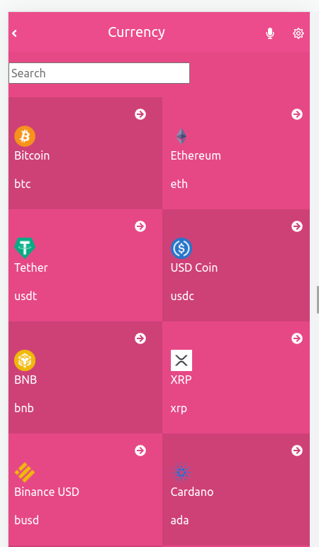
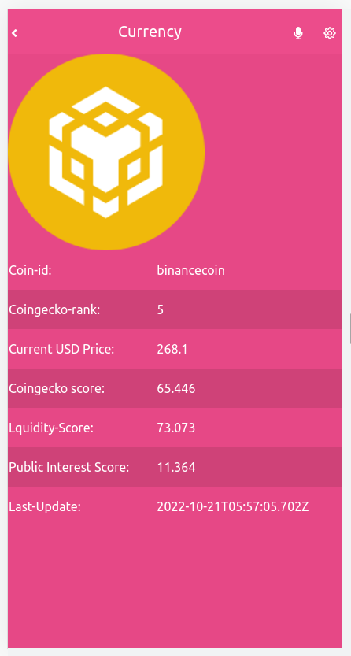

## coin-api-react-capstone

- This mobile web application iss about building a mobile web application to check a list of metrics (numeric values) fetching data from API.
- API used-is:

```
https://pro-api.coingecko.com/api/v3/
```

- Coingecko API provides crypto data such as live prices, trading volume, exchange volumes, trading pairs, historical data, contract address data, crypto categories, crypto derivatives, images and more.

# Built With

- React Js
- HTML
- CSS
- React JS
- Bootstrap
- React Router Dom
- Redux Toolkit

## Getting Started

To get a local copy up and running follow these simple example steps.

## Clone Git Repository

- Reach to following Github URL:

```
https://github.com/megha-n-bodke/coin-api-react-capstone
```

- Copy the URL.

- In Visual Studio Code “Terminal” change the current working directory to the location where you want the cloned directory.

- Type git clone in the terminal, paste the URL you copied earlier, and press “enter” to create your local clone.

## Install Dependencies(with following Command)

- npm install

## Start server

- npm start

## Screen Shots

### Home Page



### Details Page



## Live Preview

[Live Preview](https://meghageckocoin.netlify.app)

## Vedio Demo

[Vedio](https://www.loom.com/share/8c05d51e118a440b8f378623dbd51617)

## Authors

👤 **Megha Bodke**

- GitHub: [@megha-n-bodke](https://github.com/megha-n-bodke)
- LinkedIn: [Megha Bodke](https://www.linkedin.com/in/megha-bodke/)

## Show your support

Give a ⭐️ if you like this project!

## 🤝 Contributing

Contributions, issues, and feature requests are welcome!

Feel free to check the [issues page](../../issues/).

## Acknowledgments

- Thanks to Nelson Sakwa for original design.
- Thanks to [Microverse](https://www.microverse.org/) for giving this opportunity to learn ...
- Code Reviewers & Coding Partners.
- Hat tip to anyone whose code was used.
- Inspiration.

## 📝 License

# This project is [MIT](./MIT.md) licensed.

_NOTE: we recommend using the [MIT license](https://choosealicense.com/licenses/mit/) - you can set it up quickly by [using templates available on GitHub](https://docs.github.com/en/communities/setting-up-your-project-for-healthy-contributions/adding-a-license-to-a-repository). You can also use [any other license](https://choosealicense.com/licenses/) if you wish._
